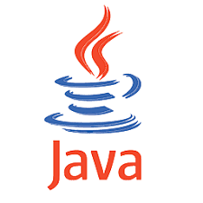

### Hey there 

 
 

Software Engineer living in Córdoba, Argentina.

I like to solve problems and get the perfect solution for the users. I'm not the kind of developer that knows everything about a particular language, but I like to learn new technologies that help me to get the best solution possible.

***My skills*** (In expertise order)

**Back-end**

**Front-end**

**Databases**

**Cloud Servers**

**Tools**\

